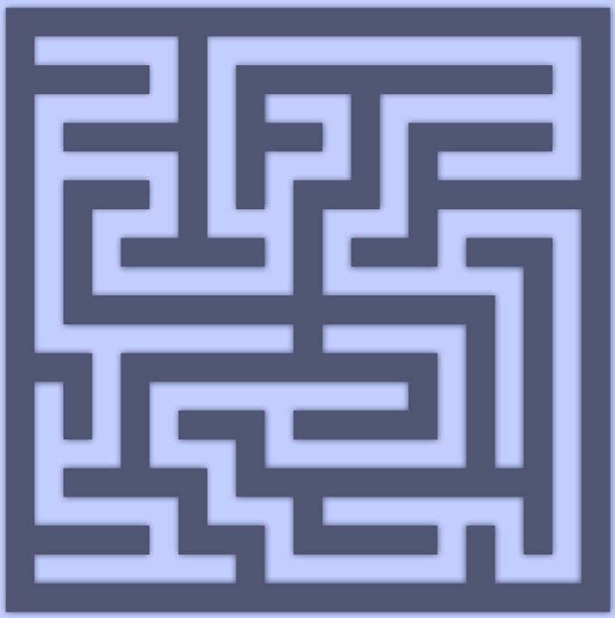

A procedural maze generator made with Unity.
- High-performance thanks to dynamic mesh generation.
- Three generation algorithms are available: Randomized DFS, Kruskal’s alg, Wilson’s alg.
- Real-Time Visualization: algorithms can be seen operating step by step.
- After generating a labyrinth you can control a pawn and try to escape.

#

#
<b>Links:</b>
- [Trailer](https://www.youtube.com/watch?v=gEkphmxIJFs&ab_channel=Nicol%C3%B2Bertoli)
- [Itch Page](https://nicobertoli.itch.io/maze-generator)
